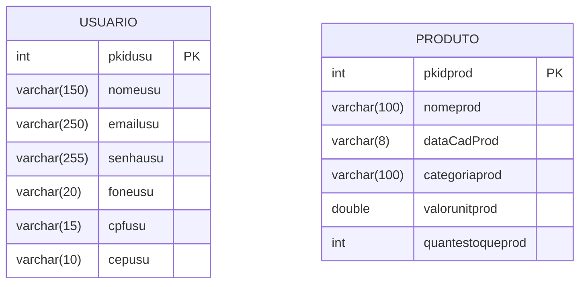

# 🚀 Projeto: Sistema de Cadastro de Usuários e Produtos

Este projeto faz parte de uma atividade prática para o curso técnico em informática do Colégio ULBRA São Lucas. Os alunos vão criar um sistema de cadastro de usuários e pets usando Java e MySQL para consolidar os conceitos de programação orientada a objetos (POO).

## 📋 Introdução Técnica

Este sistema utiliza as seguintes tecnologias e conceitos:
- **Java**: Linguagem de programação principal
- **MySQL**: Sistema de gerenciamento de banco de dados
- **POO**: Programação Orientada a Objetos
- **DAO**: Data Access Object (padrão para persistência de dados)
- **Swing**: Framework para interfaces gráficas

## 🎯 Objetivo

- Criar um sistema de cadastro simples para praticar manipulação de banco de dados, POO e interfaces gráficas.
- Implementar um sistema de login e validação de senha forte.
- Criar e manipular objetos utilizando boas práticas de programação.

## 🖥️ Pré-requisitos

- Java JDK 8 ou superior
- MySQL 5.7 ou superior
- NetBeans IDE 8.2 ou superior
- XAMPP (para gerenciamento do MySQL)
- Conhecimentos básicos em Java e SQL

## 📂 Estrutura de Pastas

```
src/main/java/com/seuprojeto/
├── br.ulbra.entity/
│   ├── Usuario.java
│   ├── Produto.java
├── br.ulbra.dao/
│   ├── UsuarioDAO.java
│   ├── ProdutoDAO.java
│   ├── ConnectionFactory.java
├── br.ulbra.view/
│   ├── FrmLogin.java
│   ├── FrmDashBoard.java
│   ├── FrmCadUsuario.java
│   ├── FrmCadProduto.java
│   ├── FrmListaUsu.java
│   ├── FrmListaProd.java
```

## 🔣 Legenda

- ✅ Requisito obrigatório - Deve ser implementado
- 🔥 Requisito extra - Implementação opcional para desafio adicional
- 🧑💻 Usuário - Relacionado ao cadastro e gerenciamento de usuários
- 🛒 Produto - Relacionado ao cadastro e gerenciamento de produtos
- 🏢 Banco de Dados - Relacionado à configuração e manipulação do banco de dados


### 🏢 Banco de Dados

## 📐 Diagrama Entidade Relacionamento (DER)



## 🧪 Requisitos (Divididos por Ação)

### 🧑💻 Usuário

#### ✅ Requisito 1 - Criar Classe Usuario

- A classe Usuario.java deve conter os seguintes atributos: 
  - pkidusu (int)
  - nomeusu (String)
  - emailusu (String)
  - senhausu (String)
  - foneusu (String)
  - cpfusu (String)
  - enderecousu (String)
- Crie os métodos:

```java
// Construtor padrão e completo
public Usuario(int id, String nome, String email, String senha, String fone, String cpf, String endereco) {}

// Getters e Setters
public int getId() {}
public void setId(int id) {}
// ... outros getters e setters
```

#### ✅ Requisito 2 - Implementar Sistema de Login

1. Criar uma tela de login (FrmLogin.java).
2. Implementar método para validar o login:

```java
public boolean validarLogin(String email, String senha) {
    // Lógica para verificar se o email e senha existem no banco
}
```

3. Se o usuário não existir, abrir tela de cadastro (FrmCadUsuario.java).

#### ✅🔥 Requisito 3 - Validar Senha Forte

- Crie um método na classe Usuario para validar a senha.
- A senha deve ter no mínimo 8 caracteres e conter pelo menos: 
  - Uma letra maiúscula
  - Uma letra minúscula
  - Um número
  - Um caractere especial (@, #, $, %, etc.)
- O que fazer: 
  - Crie um método chamado validarSenha(String senha) que retorna um boolean.
  - Use o método matches() com expressões regulares (regex) para validar.

#### ✅🔥 Requisito 4 - Confirmar Senha

- Ao cadastrar o usuário, peça para o usuário digitar a senha duas vezes para confirmação.
- Se as senhas não forem iguais, exiba uma mensagem de erro.

#### ✅ Requisito 5 - Criar Tela de Cadastro de Usuário

1. Criar FrmCadUsuario.java para permitir cadastro de usuário.
2. Chamar o método salvar() na DAO ao clicar em salvar.

#### ✅ Requisito 6 - Salvar Usuário no Banco de Dados

- Implementar o método salvar() na UsuarioDAO.java:

```java
public void salvar(Usuario usuario) {
    // Código para salvar no banco de dados
}
```

#### ✅🔥 Requisito 7 - Validar CPF

- Crie um método na classe Usuario para validar o CPF.
- O método deve verificar se o CPF é válido (formato e dígitos verificadores).
- Exemplo:

```java
public boolean validarCPF(String cpf) {
    // Implementação da validação de CPF
}
```

### 🛒 Produto

#### ✅ Requisito 1 - Criar Classe Produto

- A classe Produto.java deve conter os seguintes atributos: 
  - idProd (int)
  - nomeProd (String)
  - dataCadProd (String)
  - categoriaProd (String)
  - valorUnitProd (double)
  - quantEstoqueProd (int)
  
- Crie os métodos:

```java
// Construtor padrão e completo
public Produto(int idProd, String nomeProd, String dataCadProd, String categoriaProd, double valorUnitProd, int quantEstoqueProd) {}

// Getters e Setters
public int getIdProd() {}
public void setIdProd(int idProd) {}
```

#### ✅ Requisito 2 - Criar Tela de Cadastro de Produtos

1. Criar FrmCadProd.java para permitir cadastro de prod.
2. Chamar o método salvar() na DAO ao clicar em salvar.

#### ✅ Requisito 3 - Salvar Produto no Banco de Dados

- Implementar o método salvar() na ProdutoDAO.java:

```java
public void salvar(Produto prod) {
    // Código para salvar no banco de dados
}
```

### ✅ Requisitos Extras (Somente para Produtos)

#### 🔥 Extra 1 - Calcular valor total em estoque

- Crie um método calcularEstoque() na classe Produto para retornar o valor total no estoque.


#### ✅🔥 Extra 2 - Validar Nome do Produto

- Crie uma validação para que o nome do produto: 
  - Tenha pelo menos 5 caracteres
  - Não contenha números ou caracteres especiais
- Se o nome for inválido, exiba uma mensagem de erro.

#### ✅ Extra 3 - Criar Método de Exibição de Informações

- Crie um método exibirInformacoes() para retornar uma String com os dados formatados do produto.

## ✅ Subir a aplicação no GitHub e Criar o Readme.md do projeto


## 🚀 Como Executar o Projeto

1. **Clone o repositório**
   ```
   git clone https://github.com/seu-usuario/seu-repositorio.git
   cd seu-repositorio
   ```

2. **Configure o MySQL**
   - Inicie o XAMPP e ative o serviço MySQL
   - Acesse o phpMyAdmin (http://localhost/phpmyadmin)
   - Crie um banco de dados chamado `cadastro_produto`
   - Execute os scripts SQL fornecidos na seção "Banco de Dados"

3. **Configure o projeto no NetBeans**
   - Abra o NetBeans IDE
   - Vá para "File" > "Open Project" e selecione a pasta do projeto
   - Certifique-se de que as bibliotecas Java necessárias estão incluídas (MySQL Connector/J)

4. **Compile e execute o projeto**
   - Clique com o botão direito no projeto e selecione "Clean and Build"
   - Execute o projeto clicando em "Run" ou pressionando F6

## 📅 Cronograma Sugerido

| Semana | Atividade |
|--------|-----------|
| Dia 1 | Configuração do ambiente e banco de dados - Implementação das classes de entidade (Usuario e Pet) |
| Dia 2 |  Implementação das classes DAO  - Criação das interfaces gráficas                                 |
| Dia 3 |Testes e correção de bugs                                                                          |
| Dia 4 | Apresentação do projeto                                                                           |


## 🤝 Contribuição e Suporte

Para dúvidas ou sugestões sobre o projeto, entre em contato com o professor responsável ou abra uma issue no repositório do projeto.

- **E-mail de contato**: jeferson.leon@ulbra.br
